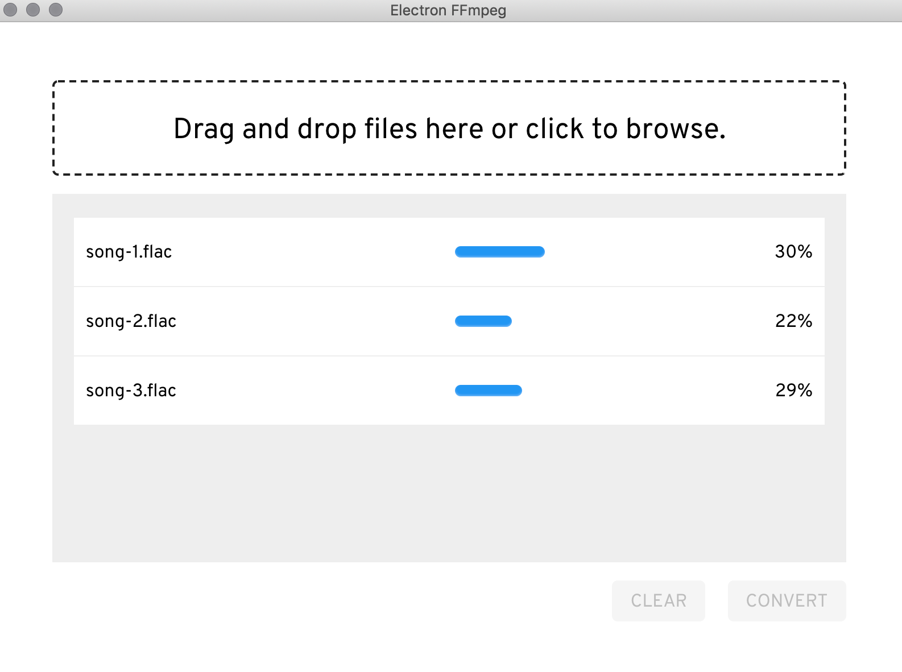

# Electron FLAC to mp3 Converter



## Description

Converts `.flac` to `.mp3` (320kbps) using `FFmpeg`.

## Getting Started

### Install Dependencies

```sh
yarn
```

### Start `webpack-dev-server`

```sh
yarn start
```

### Start `electron` (in second terminal window)

```sh
yarn electron
```

## DevTools

To enable React and Redux devtools, add a `.env` file to the root directory with environment variables as found in [the example file](https://github.com/michaelkro/electron-react/blob/master/.example.env). Instructions for finding the extension paths can be found in the [electron docs](https://electronjs.org/docs/tutorial/devtools-extension)
